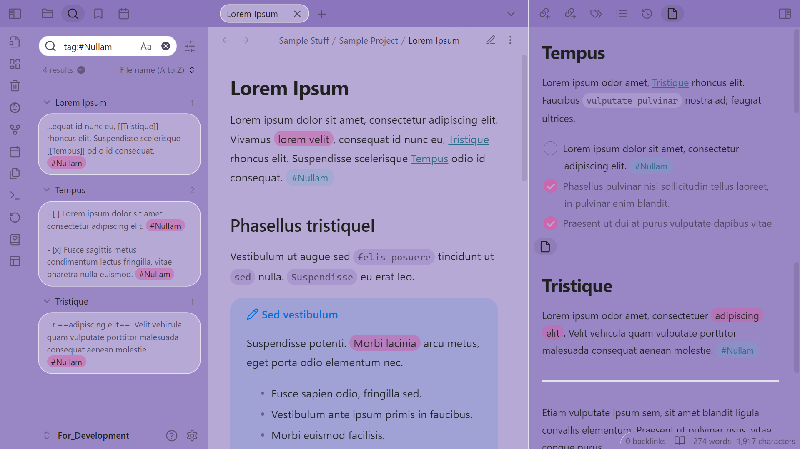
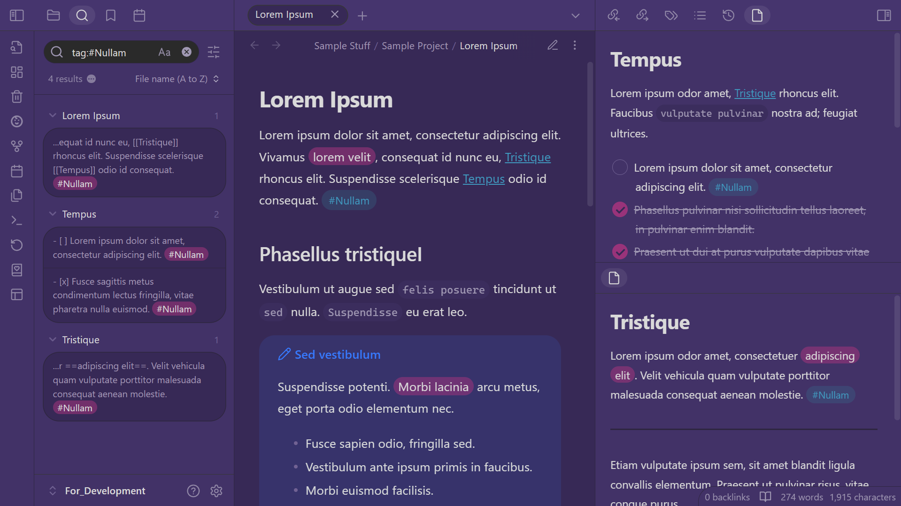
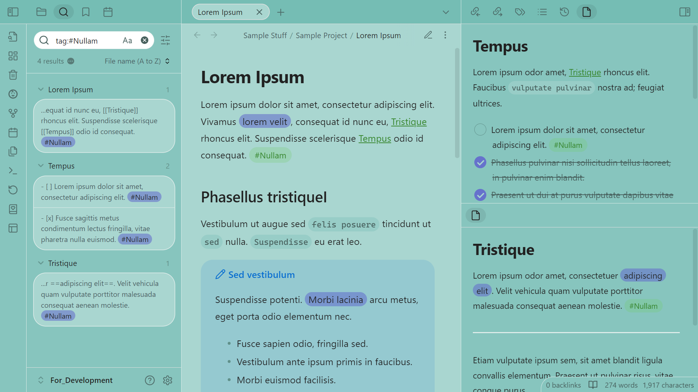
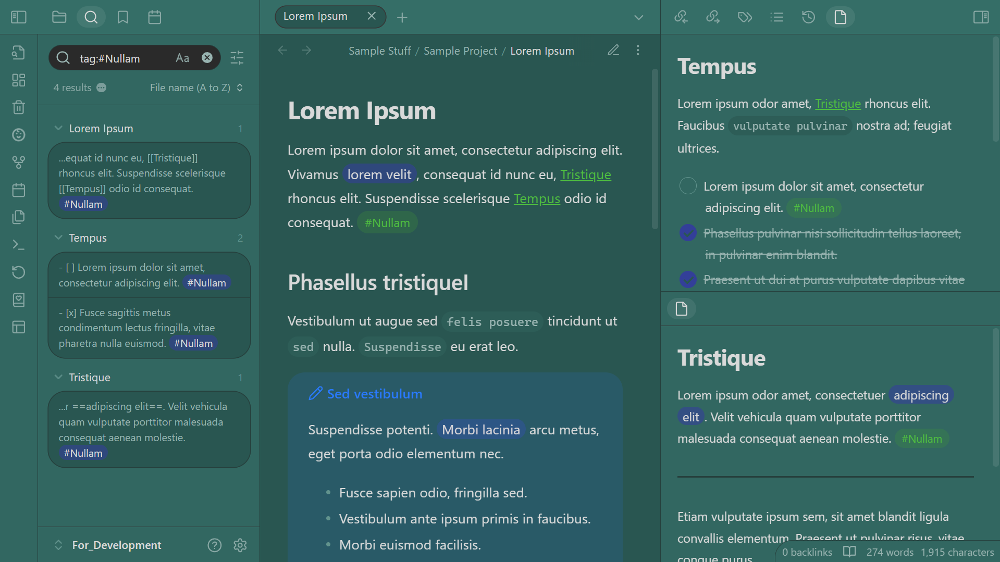
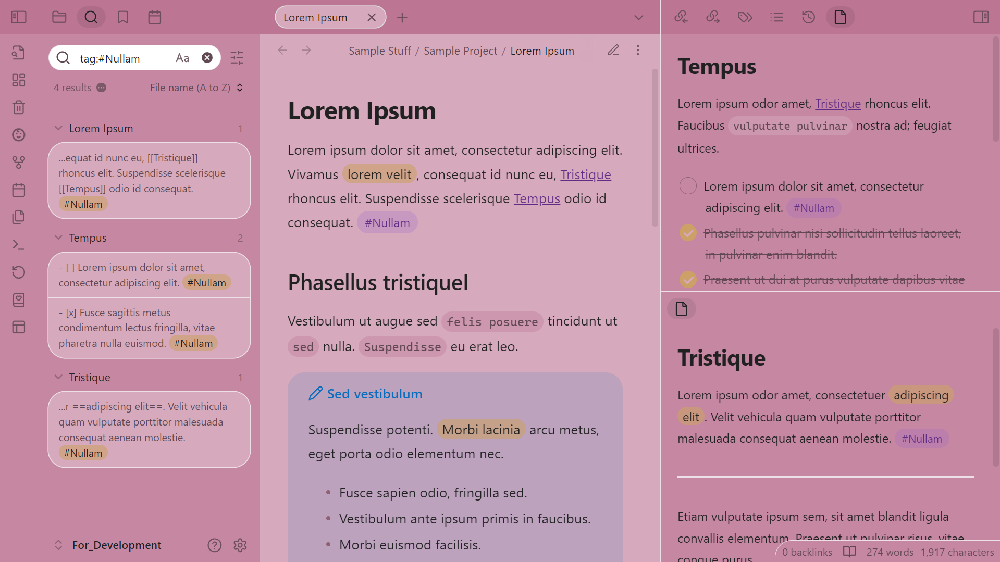

# Colored Candy
This is a cute lil' theme for [Obsidian](https://obsidian.md/) that changes the interface colors based off of your chosen accent color.

**NOTE:** This readme is temporary! I will refine it later!
# Issues
This theme is still in ==early development==, so there are a lot of broken things that need to be fixed. If you see any of these, please create an [issue](https://github.com/Erallie/colored-candy/issues) so that I know to fix it.

The following issues are already known and will be worked on in time:
- When a wiki-link is highlighted, the rounded corners repeat.
- Things look weird when a tag is highlighted.
# Previews
I haven't yet combined all my screenshots into a single image, so for now, here's everything:

