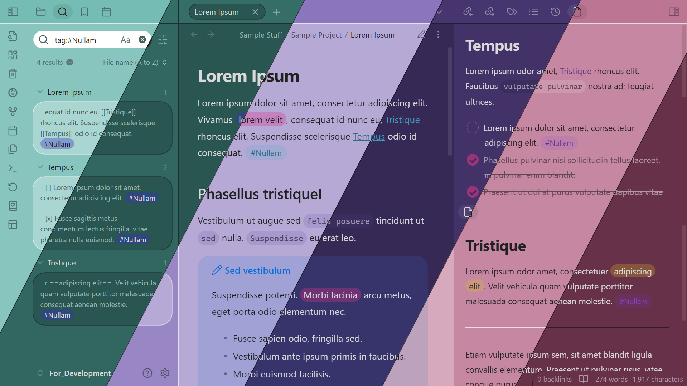

# Colored Candy

[![Our Other Projects](https://img.shields.io/badge/Our%20Other%20Projects-%E2%9D%A4-563294?style=for-the-badge&logo=data%3Aimage%2Fwebp%3Bbase64%2CUklGRu4DAABXRUJQVlA4WAoAAAAQAAAAHwAAHwAAQUxQSGABAAABgFtbm5volyZTA%2BtibzK2H0w5sDkmhe3GmxrwxGg0839r%2FvkkOogIBW7bKB0c4%2BARYihzIqfd6dfO%2B%2B3XtHsq4jJhlIvcDRcgNB%2FeieQETorBHgghRtUYqwDs%2B4U4IpcvUB%2BVUPSK54uEnTwsUJoar2DeMpzLxQpeG5DH8lxyyfLivVYAwPBbkWdOBg3qFlqiLy679iHy9UDKMZRXmYxpCcusayTHG01K%2FEtatYWuj7oI9hL4BxsxVwhoP2mlAJJ%2BuuAflc6%2BEUCQTCX9EV87xBR2H75NxLZSpWiwzqdIm7ZO7uB3oEgZKbD9Nt3EmHweEPH1t1GNsZUbKeisiwjyTm5fA3SO1yCrADZXrV2PZQJPL1tjN4%2BxUL9ie1mJobzOnDwSx6ILiF%2FW%2BTUR4tcHx0UaV75JXC1a4g6Ky5dLcTSuy9q4HhTieF64Hy1A3GHB8gLLK2e92feuqnbfPK8IVlA4IGgCAACwDQCdASogACAAPk0cjEQioaEb%2BqwAKATEtgBOl7v9V3sHcA2wG4A3gD0APLP9jX9n%2F2jmqv5AZRh7J%2BN2fOx22iE%2F4TUsecFmY%2BSf1r%2BAP%2BTfzT%2FXdIB7KX7MtdIGr1A8H0jmrrfZvqButwOaYcLWYNRq5QgAAP7%2F%2FmIMpiVNn67QXpM1rrDmRS8Nr%2F6dhD%2Bq5e%2BM%2BAtUP1%2FxOj85Ol5y3ebjz%2BpHoOf%2FWW8a%2F2ojUaKVDkVqof%2Bv4f0f6ud8i58wusz%2Fyrj%2F%2BwnM3q0769dvK%2F%2BQe04xL49tkb9t6ylCqqezZtZGuGLJ%2F5iUrPqdYc%2F8VbYZfP%2FOpZP%2F4X4q%2BqS4gPOxzdINOe5PGv%2F0TS%2FJRf4LlFrFkrWtxlS8n40grV%2BKUu%2FiwzdQzImvwH81FxL1bZyTSsrYwMku1Pk9StTtWNjSR8ZWEYBH9eTn%2FvBERii5XaWOPJ%2FFVXtVQGbv%2BFRW5jbo9tfFDu%2BDHHf8LbgUd%2F8W8Id1AehBtRNsLQWbADmvF1QJU8x5tw%2FtTUwIoSaa%2F2jkcvyVHkAsb2qoIh1KF1pPdae%2BZaqjydy6nUa9agjrDk1G4pMhEUhH%2BV%2FIUe49MjhR%2FuxyFmwQ8dDogMyQ%2BdcSBa56Lwt1wyJ%2F22%2F5O98r6q6wiM63HyaYONd36W7br%2F0%2F6y2DZ3irAddj%2FRxntvr%2FbbChSYXAfEbO%2FD0G%2FFbMFqTHypodt9T6dAx%2BUjJYfHzFf%2FM3Ec%2FAtwbjc2gka6urN1MlSLb2VTS9Q5r8fkDzxZz6vu1OYUPUB1UFMIhYGvMATbxxoTmVhvpovzAc%2F8nbOjw3wAAA)](https://github.com/Erallie)
[)](https://www.paypal.com/donate/?hosted_button_id=PHHGM83BQZ8MA)

---

This is a cute lil' theme for [Obsidian](https://obsidian.md/) that changes the interface colors based off of your chosen accent color.

You can choose your accent color in [Obsidian](https://obsidian.md/) under **Settings → Appearance → Accent color**.

This theme will change the **background colors** according to your accent color's **hue**, and create **two *new* psuedo accent colors** with their hues **offset** from the original, and calculating their saturation and lightness from the original.

This theme has a few configurable options accessible through the [Style Settings](https://obsidian.md/plugins?id=obsidian-style-settings) plugin.

If you see anything that looks broken and needs fixing, please create an [issue](https://github.com/Erallie/colored-candy/issues) so that I know to fix it.

> ### **PLEASE NOTE:**
> This theme is *intentionally* low-contrast. However, I will try to keep this theme accessibility-friendly as best I can. If anything is too difficult for you to read at default settings, create an [issue](https://github.com/Erallie/colored-candy/issues), and I'll see what I can do.
> 
> Additionally, if you cannot stand the lack of contrast, I added a [Style Settings](https://obsidian.md/plugins?id=obsidian-style-settings) option for **Background-to-text contrast**.
## Installation
### Obsidian Marketplace
To install this plugin via the Obsidian Marketplace, perform the following steps:
1. Navigate to **Settings → Appearance → Themes** and select **Manage**.
2. Search for "Colored Candy" and select the theme by **Erika Gozar**.
3. Select **Install and use**.
### BRAT
Install this theme using [BRAT](https://obsidian.md/plugins?id=obsidian42-brat) by doing the following:
1. Make sure the [BRAT](https://obsidian.md/plugins?id=obsidian42-brat) plugin is installed in your vault.
2. Go to **Settings → BRAT → Beta Themes List → Add Beta Theme**
3. Enter `https://github.com/Erallie/colored-candy` into the input field and select **Add Theme**.
### Manual installation
To install this theme manually, follow these steps:
1. Download [`theme.css`](https://github.com/Erallie/colored-candy/blob/master/theme.css) and [`manifest.json`](https://github.com/Erallie/colored-candy/blob/master/manifest.json) from the [master branch](https://github.com/Erallie/colored-candy/tree/master).
2. Go to your **Themes folder** (`[vault root]/.obsidian/themes`) and create a new subfolder called `Colored Candy` *(case sensitive)*.
3. Move the downloaded files to the new folder.
